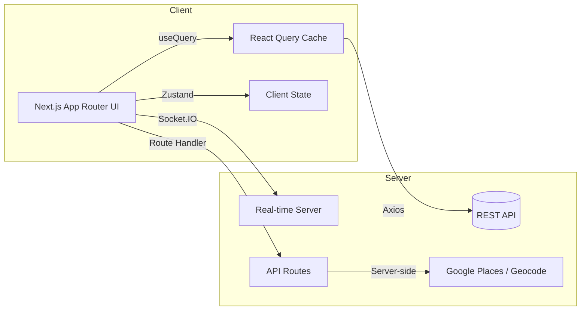

<div align="center">

# 오메추 -- 오늘 뭐 먹지?


<br/>

**사용자 상태와 취향을 바탕으로 상황 맞춤 메뉴/맛집을 추천하는 웹 서비스**

*Context-aware menu & restaurant recommendation service*

<br/>

<a href="https://omechu.log8.kr/">배포 URL</a> · 데모 계정: <code>user@example.com / User1234!</code>

</div>

---

## 개요

**오메추**는 사용자의 기본 상태, 취향, 컨디션 같은 맥락을 반영해 **맞춤 메뉴와 근처 맛집을 빠르게 추천**합니다. 고민 시간을 줄이고, 선택을 더 즐겁게 만드는 것이 목표입니다.

### 문제 인식

* 반복되는 "오늘 뭐 먹지?"에서 오는 **의사결정 피로**
* 광고/검색 중심 리스트로 인한 **정보 과잉**과 **개인 맥락 미반영**
* **새로고침/이탈 시 상태 유실**, 느린 응답, 빈약한 폴백 등 UX 끊김

### 접근

1. **온보딩 5단계**로 최소 입력으로 핵심 신호 수집
2. **컨텍스트 기반 탐색**: 태그, 가격, 정렬, 검색(디바운스) + **무한 스크롤**
3. **상세 페이지 실사용 시나리오**: 리뷰 정렬/필터, 신고, 이미지 폴백, 평점 요약
4. **랜덤 추천/메뉴 배틀**로 선택 과정 자체를 재미있게 전환
5. **마이페이지**에서 상태/취향 재설정, 먹부림 기록 관리 -> 추천 품질 순환 개선

> 현재 추천은 **규칙 기반 필터+정렬**로 안정 운영 중이며, 이후 **개인화 점수/가중치** 기반 모델로 고도화 예정.

---

## 빠른 링크

| | |
|---|---|
| [아키텍처](#아키텍처) | [주요 기능](#주요-기능) |
| [설치 및 실행](#설치-및-실행) | [폴더 구조](#폴더-구조) |
| [기술 스택](#기술-스택) | [협업 규칙](#협업-규칙) |
| [트러블슈팅](#트러블슈팅--해결-과정) | [AI 활용](#ai-활용-내역) |
| [로드맵](#로드맵) | [기여자](#기여자) |

---

## 아키텍처

* **서버 상태**: TanStack Query로 캐싱/무효화/낙관적 업데이트/무한 스크롤 관리
* **클라이언트 상태**: Zustand로 온보딩 진행/모달/뷰 로컬 상태 관리
* **네트워크 계층 분리**: `axiosInstance`(인증) · `axiosPublicInstance`(공개 업로드)
* **실시간 통신**: Socket.IO로 메뉴 배틀 실시간 대결 처리
* **이미지 안정화**: 한글 파일명 **NFC 정규화**, 확장자 소문자, onError 폴백/재시도
* **API Routes**: Google Places/Geocode 프록시로 API 키 보호



---

## 주요 기능

### 1) 온보딩 5단계 + 진행도 바

* **가치**: 최소 입력으로 맞춤 초기 추천 생성, 재방문 복원
* **기술**: Zustand 상태/검증, 로컬 스냅샷, 서버 동기화
* **테스트**: 새로고침/뒤로가기 안전, 모바일 키보드 UX

### 2) 메뉴/맛집 추천 (검색, 필터, 정렬, 무한 스크롤)

* **가치**: 조건 변경에도 끊기지 않는 탐색 리듬
* **기술**: `useInfiniteQuery`, 쿼리키/`staleTime`·`gcTime` 설계, 프리패칭
* **테스트**: 필터 조합 캐시 무효화, 스크롤 경계, 실패 폴백

### 3) 랜덤 추천

* **가치**: 선택 과부하 없이 한 번의 클릭으로 메뉴 결정
* **기술**: `RandomDrawSelector`로 카테고리 선택 후 무작위 메뉴 추천, 결과 상세 페이지 연결
* **경로**: `/random-recommend`

### 4) 메뉴 배틀

* **가치**: 두 메뉴를 대결시켜 선택 과정을 게임처럼 전환
* **기술**: Socket.IO 실시간 통신, 룰렛 기반 메뉴 대결, `BattleBoard`/`BattleResult` 위젯
* **경로**: `/menu-battle`

### 5) 맛집 상세

* **가치**: 사진, 리뷰, 평점을 한 화면에서 빠르게 판단
* **기술**: 이미지 폴백/NFC 정규화, 접근성 alt, 딥링크 경로
* **테스트**: 빈 상태/지연/실패 폴백, 모달 포커스 트랩

### 6) 찜(Like) & 추천 목록

* **가치**: 즉시 반응/롤백으로 일관 UX
* **기술**: `useMutation` 낙관적 업데이트 + 오류 롤백, 쿼리 동기화
* **테스트**: 연속 토글/401 만료/롤백 체크

### 7) 마이페이지

* **프로필/기본 상태/활동**: 보호 라우팅, 서버/클라 상태 분리 저장, 페이지네이션
* **먹부림 기록**: 기간별 필터링(`PeriodTap`), 커스텀 `DatePicker`, 기록 조회/관리
* **알림 설정**: `TimePickerModal`로 시간 지정, `ToggleSwitch`로 알림 ON/OFF
* **경로**: `/mypage`, `/mypage/mukburim-log`, `/mypage/alarm-setting`

### 8) 인증 (3단계 가입, 보호 라우팅)

* **가치**: 명확한 가입 플로우, 보안 유지된 개인화
* **기술**: JWT, 인터셉터 토큰 부착/에러 공통 처리, 라우트 가드

### 9) 이미지 업로드 (공개/인증 분리, 폴백)

* **가치**: 실패 확률 감소, 사용자 혼란 최소화
* **기술**: `/v1/uploads/public` vs `/v1/uploads`, 파일명 정규화/소문자화, 썸네일 미리보기

### 10) 에러/로딩 UX

* **전역 에러 처리**: `error.tsx`, `global-error.tsx`로 런타임 에러 바운더리
* **Not Found**: `not-found.tsx`로 404 커스텀 페이지
* **로딩 폴백**: `loading.tsx`, 스켈레톤 UI(`SkeletonRecommendedFoodCard`, `SkeletonUIFoodBox`)

---

## 설치 및 실행

```bash
# 1) 클론
git clone https://github.com/Team-Omechu/Omechu-web.git
cd Omechu-web/omechu-app

# 2) 패키지 설치
pnpm install

# 3) 개발 서버
pnpm dev          # http://localhost:3000

# 4) 빌드/미리보기
pnpm build
pnpm start
```

### 환경 변수 예시 (`.env.local`)

```env
NEXT_PUBLIC_API_URL=https://api.example.com
NEXT_PUBLIC_GOOGLE_MAPS_API_KEY=...
GOOGLE_MAP_SERVER_API_KEY=...
NEXT_PUBLIC_EMBED_API_URL=https://embed.example.com
NEXT_PUBLIC_SENTRY_DSN=...
SENTRY_AUTH_TOKEN=...
SENTRY_ORG=omechu
SENTRY_PROJECT=omechu-fe
```

> 이미지 최적화를 위해 `sharp`가 자동으로 설치됩니다.

---

## 폴더 구조

> **Feature-Sliced Design (FSD)** 아키텍처를 기반으로 레이어를 분리합니다.

```text
src/
├── app/                        # Next.js App Router
│   ├── (auth)/                 # 인증 페이지 (로그인, 회원가입)
│   ├── (public)/               # 비로그인 접근 가능
│   │   ├── mainpage/           #   메인 페이지 + 추천 결과
│   │   ├── random-recommend/   #   랜덤 메뉴 추천
│   │   └── menu-battle/        #   메뉴 배틀
│   ├── (private)/              # 로그인 필수
│   │   ├── mypage/             #   마이페이지
│   │   │   ├── mukburim-log/   #     먹부림 기록
│   │   │   ├── recommended-list/ #   추천 목록
│   │   │   ├── basic-state/    #     기본 상태 설정
│   │   │   └── (settings)/     #     계정/알림/문의
│   │   └── onboarding/         #   온보딩 플로우
│   ├── api/                    # Next.js Route Handlers
│   │   ├── places/             #   Google Places 프록시
│   │   └── geocode/            #   Geocode 프록시
│   ├── error.tsx               # 에러 바운더리
│   ├── not-found.tsx           # 404 페이지
│   └── loading.tsx             # 글로벌 로딩
│
├── widgets/                    # 복합 UI 블록 (여러 entities 조합)
│   ├── LoginModal/             #   로그인 모달
│   ├── MenuCard/               #   메뉴 카드
│   ├── RandomDraw/             #   랜덤 드로우 셀렉터
│   ├── RandomRecommendModal/   #   랜덤 추천 모달
│   ├── TagCard/                #   태그 카드
│   ├── auth/                   #   인증 관련 위젯
│   ├── mainpage/               #   메인페이지 위젯
│   ├── menubattle/             #   메뉴 배틀 (BattleBoard, BattleResult)
│   ├── mypage/                 #   마이페이지 위젯
│   └── step/                   #   온보딩 단계 위젯
│
├── entities/                   # 비즈니스 엔티티 (12개 도메인)
│   ├── user/                   #   사용자 인증/프로필
│   ├── menu/                   #   메뉴 데이터
│   ├── restaurant/             #   맛집 데이터
│   ├── tag/                    #   음식 취향 태그
│   ├── question/               #   추천 질문/응답
│   ├── onboarding/             #   온보딩 플로우
│   ├── mukburim/               #   먹부림 기록
│   ├── menubattle/             #   메뉴 배틀
│   ├── randomDraw/             #   랜덤 드로우
│   ├── location/               #   위치 정보
│   ├── alarm/                  #   알림 설정
│   └── mypage/                 #   마이페이지
│
└── shared/                     # 재사용 코드
    ├── ui/                     #   공통 컴포넌트 (Button, Modal, Header, Toast 등)
    │   ├── card/               #     카드 + SkeletonRecommendedFoodCard
    │   ├── box/                #     박스 + SkeletonUIFoodBox
    │   ├── modal/              #     모달 시스템
    │   ├── loading/            #     로딩 컴포넌트
    │   └── ...                 #     button, input, form-field, toast 등
    ├── api/                    #   Axios 인스턴스, 인터셉터
    ├── lib/                    #   유틸리티 함수
    ├── config/                 #   설정 파일
    ├── constants/              #   상수 정의
    ├── providers/              #   QueryClient, 전역 Provider
    └── assets/                 #   정적 리소스
```

> 원칙: **app -> widgets -> entities -> shared** (상위->하위만 import 가능)

---

## 기술 스택

<table>
  <tr>
    <th align="left">Core</th>
    <td>
      
      
      
      
    </td>
  </tr>
  <tr>
    <th align="left">State & Validation</th>
    <td>
      
      
      
      
    </td>
  </tr>
  <tr>
    <th align="left">Network</th>
    <td>
      
      
    </td>
  </tr>
  <tr>
    <th align="left">UI Utilities</th>
    <td>
      
      
      
      
    </td>
  </tr>
  <tr>
    <th align="left">Tooling & Deploy</th>
    <td>
      
      
      
      
      
    </td>
  </tr>
  <tr>
    <th align="left">Monitoring</th>
    <td>
      
      
      
    </td>
  </tr>
</table>

---

## 협업 규칙

> 협업 규칙 상세는 [`omechu-app/docs/CONVENTIONS.md`](./omechu-app/docs/CONVENTIONS.md)를 참고하세요.

태그 기반 커밋 컨벤션을 사용합니다.

| 태그         | 설명             |
| ---------- | -------------- |
| `feat`     | 새로운 기능 추가      |
| `fix`      | 버그 수정          |
| `docs`     | 문서 수정          |
| `style`    | 코드 스타일 변경      |
| `design`   | UI 디자인 변경      |
| `test`     | 테스트 작성/수정      |
| `refactor` | 리팩토링(기능 변화 없음) |
| `build`    | 빌드 설정 수정       |
| `ci`       | CI 설정 변경       |
| `perf`     | 성능 개선          |
| `chore`    | 설정/패키지 등 기타    |
| `rename`   | 파일/폴더명 변경      |
| `remove`   | 파일/리소스 삭제      |
| `wip`      | 진행 중 임시 커밋     |
| `hotfix`   | 운영 긴급 수정       |

**작성 규칙 예시**

```bash
feat: 감정 선택 페이지 레이아웃 구현 #12
fix: 로그인 실패 시 에러 메시지 출력 오류 수정 #7
```

---

## 트러블슈팅 & 해결 과정

* **검색 직후 자동 재검색**: `submittedTerm` vs `inputValue` 분리, 초기화 직후 입력 무시 가드
* **이미지 한글 파일명(NFC/NFD)**: 업로드 **NFC 정규화**, 확장자 소문자, onError 재시도/폴백
* **공개/인증 업로드 분리**: `axiosPublicInstance` + `/v1/uploads/public` 도입으로 401 이슈 해소
* **동적 라우팅 타입 오류**: 일부 페이지 **Client Component** 전환 + `useParams()` 사용
* **react-datepicker 검증**: 제어형 props로 강제, setState 직전 가드
* **찜 토글 지연**: `onMutate/onError/onSettled` 낙관적 업데이트 + 롤백
* **먹부림 기록 기간 탭 전환 시 API 재요청**: `staleTime` 설정으로 불필요한 리패칭 방지, 탭 전환 시 쿼리키 분리
* **이미지 폴백 처리 개선**: `onError` 콜백에서 기본 이미지로 대체, 무한 재시도 방지 로직 추가
* **스켈레톤 UI 도입**: `SkeletonRecommendedFoodCard`, `SkeletonUIFoodBox`로 로딩 중 레이아웃 시프트(CLS) 최소화

> 상세 로그/스크린샷은 별도 문서(노션) 참고.

---

## AI 활용 내역

* **Gemini 기반 코드 리뷰**: 컴포넌트 경계, prop 드릴링, 쿼리키/에러 패턴 점검 및 리팩터링 아이디어 도출

---

## 로드맵

- [x] 랜덤 메뉴 추천 기능
- [x] 메뉴 배틀 (Socket.IO 실시간 대결)
- [x] 먹부림 기록 (기간별 필터, DatePicker)
- [x] 알림 설정 (TimePickerModal, ToggleSwitch)
- [x] 스켈레톤 UI / 에러 바운더리 / Not Found 페이지
- [x] Google Places / Geocode API 프록시
- [ ] 개인화 점수/가중치 기반 추천 엔진 고도화
- [ ] 리뷰 품질 신뢰도(가중치) 반영 정렬
- [ ] 이미지 업로드 파이프라인 리트라이/썸네일 워커
- [ ] i18n(한/영) 및 접근성 감사(a11y)
- [ ] 성능 모니터링(LCP/CLS/INP) 대시보드

---

## 기여자

<table>
  <tr>
    <td align="center" width="150">
      <a href="https://github.com/theSnackOverflow"></a><br/>
      <b>2ssac</b><br/>
      <sub>FE</sub><br/>
      <a href="https://github.com/theSnackOverflow"></a>
    </td>
    <td align="center" width="150">
      <a href="https://github.com/Head-ddy"></a><br/>
      <b>라희수</b><br/>
      <sub>FE</sub><br/>
      <a href="https://github.com/Head-ddy"></a>
    </td>
    <td align="center" width="150">
      <a href="https://github.com/IISweetHeartII"></a><br/>
      <b>김덕환</b><br/>
      <sub>FE</sub><br/>
      <a href="https://github.com/IISweetHeartII"></a>
      <a href="https://log8.kr/portfolio/"></a>
    </td>
    <td align="center" width="150">
      <a href="https://github.com/jeonbinggu"></a><br/>
      <b>전병국</b><br/>
      <sub>FE</sub><br/>
      <a href="https://github.com/jeonbinggu"></a>
    </td>
  </tr>
</table>

---

<p align="center">
  <sub>UMC 8th · Omechu · 2025</sub>
</p>
